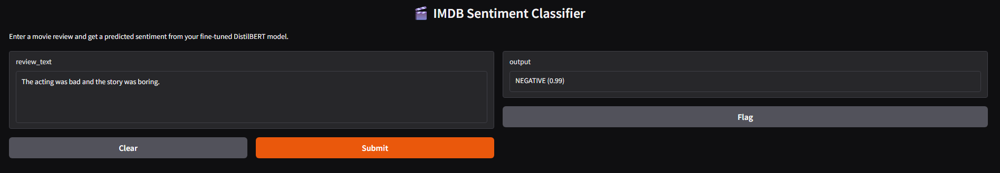
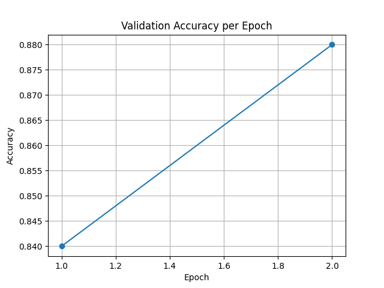

# IMDB Sentiment Classifier (DistilBERT)

A fine-tuned DistilBERT model trained on the IMDB movie review dataset for binary sentiment classification.

## Hosted Model
https://huggingface.co/khushon123/imdb-sentiment-model


---


## Gradio Web App
https://huggingface.co/spaces/Khushon123/imdb-sentiment-app



---

## Metrics & Performance

| Metric        | Value        |
|---------------|--------------|
| Validation Accuracy (Epoch 1) | 0.84 |
| Validation Accuracy (Epoch 2) | 0.88 |
| Training Time  | ~3 minutes (RTX 4080 GPU) |
| Dataset Size   | 2000 training / 500 test samples |

### Accuracy Over Epochs



---

## Sample Predictions

| Review Text                                  | Predicted Label | Confidence |
|----------------------------------------------|------------------|------------|
| "Absolutely loved this movie!"               | POSITIVE         | 0.98       |
| "Terrible acting and a boring plot."         | NEGATIVE         | 0.96       |
| "It was okay, not the best I've seen."       | POSITIVE         | 0.67       |

---

## Usage

### Local Inference

```python
from transformers import pipeline

classifier = pipeline("sentiment-analysis", model="./exported_model")
print(classifier("This film was unexpectedly great!"))
```

### Gradio App

```bash
python app.py
```

Runs an interactive browser-based sentiment classifier.

---

## Model Details

- Base Model: distilbert-base-uncased
- Fine-tuned On: IMDB movie reviews (subset of 2,000 train + 500 test)
- Trained Using: Hugging Face Transformers, PyTorch
- Hardware: RTX 4080 Laptop GPU
- Training Time: ~3 minutes

---

## Exported Model

Weights and tokenizer saved in `exported_model/` directory. You can also upload this to the Hugging Face Hub for cloud deployment.

---

## License

MIT License
